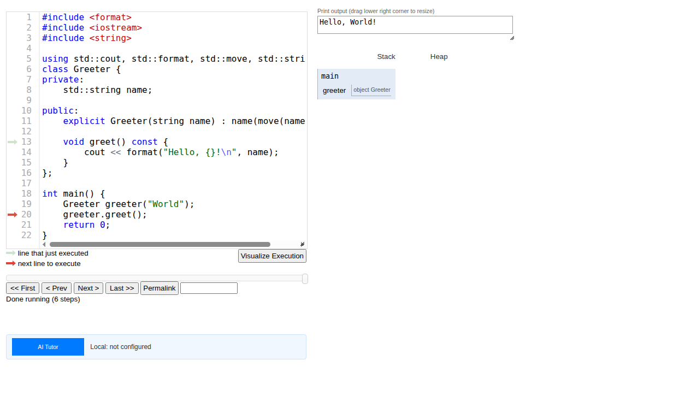

# OPT_CPP — In-browser C++ Visualizer Debugger

> A browser-only C++ execution tool: type C++, run it in-WASM
> (xeus-cpp / Clang-REPL), and step through Python-Tutor-style
> visualizations — stack frames, local variables, heap pointers,
> and an execution slider — with an "Ask AI" tutor alongside.
> No install, runs on any student's laptop or phone.

## Try it — no install, runs in your browser

[](https://dive4dec.github.io/OPT_CPP/live.html#code=%23include%20%3Cformat%3E%0A%23include%20%3Ciostream%3E%0A%23include%20%3Cstring%3E%0A%0Ausing%20std%3A%3Acout,%20std%3A%3Aformat,%20std%3A%3Amove,%20std%3A%3Astring%3B%0Aclass%20Greeter%20%7B%0Aprivate%3A%0A%20%20%20%20std%3A%3Astring%20name%3B%0A%0Apublic%3A%0A%20%20%20%20explicit%20Greeter%28string%20name%29%20%3A%20name%28move%28name%29%29%20%7B%7D%0A%0A%20%20%20%20void%20greet%28%29%20const%20%7B%0A%20%20%20%20%20%20%20%20cout%20%3C%3C%20format%28%22Hello,%20%7B%7D!%5Cn%22,%20name%29%3B%0A%20%20%20%20%7D%0A%7D%3B%0A%0Aint%20main%28%29%20%7B%0A%20%20%20%20Greeter%20greeter%28%22World%22%29%3B%0A%20%20%20%20greeter.greet%28%29%3B%0A%20%20%20%20return%200%3B%0A%7D&curInstr=6&mode=display&py=cpp&rawInputLstJSON=%5B%5D)

The badge above opens a ready-to-step example (a small `Greeter`
class) right on the GitHub Pages deployment. Watch the call stack
on the right — the invisible state (frames, local variables,
`greeter` of type `Greeter`) becomes visible:

<p align="center">
  
</p>

---

## Table of Contents

1. [Motivation](#motivation)
2. [Use cases & the three deployment modes](#use-cases--the-three-deployment-modes)
3. [Usage guide](#usage-guide)
4. [Developer guide](#developer-guide)
   - [Repo layout](#repo-layout)
   - [Deployment options](#deployment-options)
   - [Build-time configuration](#build-time-configuration)
   - [How it was developed with Hermes Agent (agentic coding)](#how-it-was-developed-with-hermes-agent-agentic-coding)
   - [Upgrading the C++ runtime (xeus-cpp) — a worked agentic prompt](#upgrading-the-c-runtime-xeus-cpp--a-worked-agentic-prompt)
5. [Limitations](#limitations)
6. [If lldb becomes available to Clang / xeus-cpp](#if-lldb-becomes-available-to-clang--xeus-cpp)
7. [References](#references)

---

## Motivation

Teaching C++ has one structural problem that Python and JavaScript
don't have: **the state students need to see is invisible**.

- Pointers, heap allocations, and `*p = 10` don't show up in a
  print statement.
- A "compiles but does the wrong thing" bug is a *logical* bug —
  the program runs and produces an answer, but the answer is wrong
  because the student's mental model of the state diverged from the
  compiler's at some step.
- The classic debugger (gdb/lldb) is a text UI with no visual
  memory layout, and installing it on every student's machine is
  a non-starter.

OPT_CPP addresses both problems at once:

1. **It makes invisible state visible** — every step shows the
   call stack, the local variables (with types and values), and a
   pointer diagram of the heap. This is the *logical-error*
   workflow: students find the line where their mental model
   diverges from the machine's.

2. **It runs in the browser** — no install. The C++ kernel is
   [xeus-cpp](https://github.com/compiler-research/xeus-cpp)
   (a Clang-REPL-style in-process C++ compiler) compiled to WASM via
   [emscripten-forge-4x](https://prefix.dev/emscripten-forge-4x/emscripten-wasm32/),
   and the frontend is a
   [Python Tutor](https://pythontutor.com/)-derived execution
   visualizer (C++ flavor:
   <https://pythontutor.com/visualize.html#interpret=cpp>).

3. **It ships an AI tutor alongside** — students can ask "why is
   my code wrong?" and get a per-codebase explanation. This is
   the *syntax-error* workflow: the AI reads the compiler's
   diagnostic and the student's source, and explains both.

The design goal was a **zero-friction tool** a student can open in
a phone browser from a lecture URL and immediately start stepping
through code — no SSH, no VS Code, no "install the lab environment".

## Use cases & the three deployment modes

OPT_CPP ships as one Docker image (one build, several tags) but
three **AI-tutor backends** are supported at build time via
`SINGLE_MODE`:

### 1. **API mode** — server-side LLM, key injected by nginx

Used by the primary teaching deployment (server-side; see
[developer guide](#deployment-options) for the deploy recipe).

- Build args: `SINGLE_MODE=api`, `API_DEFAULT_MODE=api`,
  `API_BASE_URL=/OPT_CPP/ai-proxy`, `API_HIDE_API_PANEL=true`.
- The browser never sees the API key. The frontend calls
  **same-origin `/OPT_CPP/ai-proxy/chat`**, nginx (the image's
  stage 4) proxies to the LLM endpoint and injects the key from a
  Kubernetes secret (`opt-cpp-api-key`). See
  [`optlite-components/nginx.conf`](optlite-components/nginx.conf) — the
  `location /ai-proxy/` block.
- **Why this mode**: for a course, the instructor owns the LLM
  bill and the students don't need to configure anything. It
  also works on any network (no 1.5 GB WebLLM download).

### 2. **Serverless / local (WebLLM) mode** — LLM runs in the browser

Used by the flex (self-hosted) deployment and by the
GitHub Pages build (below).

- Build args: `SINGLE_MODE=local` (no API proxy at all).
- The frontend loads [WebLLM](https://github.com/mlc-ai/web-llm)
  (MLC-LLM's browser runtime) and a small GGUF model
  (`sft_model_1.5B-q4f16_1-MLC`) — roughly a 1.5 GB one-time
  download, cached in IndexedDB. After that, inference is fully
  client-side: no server, no key, no bill.
- **Why this mode**: for self-study, for students without
  institutional accounts, or for demos where you don't want to
  point at a backend. It also means the GitHub Pages deployment
  (which has no server to hold a key) is viable.

### 3. **GitHub Pages deployment** — free static hosting, flex config

`https://dive4dec.github.io/OPT_CPP/` is built by
[`.github/workflows/deploy.yml`](.github/workflows/deploy.yml)
on every push to `main`. The workflow:

1. Builds `webllm-components` (rollup → `lib/index.js`).
2. Builds `optlite-components` (webpack → `build/`) with the
   **flex** build args (no `SINGLE_MODE` lock, no API key,
   API panel visible so users can choose).
3. Downloads the xeus-cpp WASM runtime (see
   [developer guide](#upgrading-the-c-runtime-xeus-cpp--a-worked-agentic-prompt)
   for the exact pins) into `build/xeus-cpp/`.
4. Publishes `build/` to the `gh-pages` branch via
   [`peaceiris/actions-gh-pages`](https://github.com/peaceiris/actions-gh-pages).

Because Pages has no backend, this build is effectively the
"flex" variant — the user can pick WebLLM (local) or paste their
own API key/endpoint into the AI Tutor panel.

### Side-by-side

| Mode | LLM runs | Key | Network req | Best for |
|---|---|---|---|---|
| API (server, course deployment) | Server (LiteLLM on 4×RTX6000) | In K8s secret, injected by nginx | Any | Course use, phones, restricted networks |
| Serverless (flex / self-hosted) | Browser (WebLLM / MLC) | None | One-time 1.5 GB model download | Self-study, no-backend demos |
| GitHub Pages | Browser or user-pasted API | None / user-provided | One-time 1.5 GB model download (if local) | Public sharing, no infra |

All three share the same frontend, the same xeus-cpp kernel, and
the same trace-based visualizer. Only the AI-tutor backend
differs, and it is selected at build time (see
[build-time configuration](#build-time-configuration)).

---

## Usage guide

There are two entry pages, and they are **the same application**
with different default focus:

- **`live.html`** — *Live Programming Mode*. Code editor on top,
  run/visualize button, AI chat docked beside it. This is where
  students write and run code.
- **`index.html` / `visualize.html`** — *Visualize Mode*. Code
  editor plus the execution visualizer (stack, variables, heap,
  slider) shown prominently. This is where students step through.

You can move between them at any time with the **Visualize
Execution** button (opens the visualize page with your current
code) or the **Open in Live Mode** button on the visualize page.
Both carry your code, mode, and input state across via the URL
hash.

### 3.1 Live mode — writing and running code

1. Type C++ in the editor (`#codeInputPane`).
2. Click **Visualize Execution** — the program is sent to the
   xeus-cpp kernel, compiled in-WASM, and instrumented. The
   visualize page opens with the execution ready to step.
3. If the program reads input (`std::cin >> x`):
   - Provide it via the **Permalink** URL (`rawInputLstJSON`,
     see [3.3](#33-permalinks-and-sharing)), *or*
   - When the run exhausts the pre-seeded input, an
     **"Enter user input:"** box appears. Type a value and
     submit — the program re-runs from a fresh kernel with your
     value and resumes at the `cin` line, which then shows the
     value you typed. (`while (std::cin >> x)` loops end
     naturally on EOF and never prompt.)
4. Errors appear in the error pane. A **compilation error** is a
   syntax problem → use **Ask AI**. A program that *runs but
   misbehaves* is a logic problem → step through (3.2).

### 3.2 Visualize mode — stepping through code (for logical errors)

This is the core workflow for **logical errors** ("it compiles
but the answer is wrong").

- **Execution slider** + **First / Prev / Next / Last** buttons:
  move statement-by-statement. The current line is highlighted
  with a red "next" arrow; the just-executed line shows a green
  arrow.
- At every step, read:
  - **Call stack** — the active function and its local
    variables (name, type, value).
  - **Heap / pointer diagram** — allocated blocks and the
    pointers that reference them (dangling pointers shown when a
    block is freed).
  - **Print output** — what `std::cout` has produced so far.
- **The debugging question**: at which step does a variable take
  a value you didn't expect? That line is your bug. The point of
  the tool is to make that divergence *visible* rather than
  guessable.

**Recommended student habit:** form a prediction ("after this
loop `sum` should be 6"), step to the loop end, and check the
actual value. A mismatch tells you exactly where to look.

### 3.3 Permalinks and sharing

- The **Permalink** button (or the URL itself) encodes the entire
  state in the URL `#` fragment: the code (`code=`), the mode
  (`mode=edit|display`), the inputs
  (`rawInputLstJSON=["1","2","3"]`), and even the current step
  (`curInstr=`).
- Send that URL to a student or paste it into a problem set;
  opening it reproduces the exact code, inputs, and (optionally)
  the execution step.
- To share a specific *point in the execution*, step to it first,
  then click **Permalink** — the `curInstr` in the URL lands the
  reader on that exact step.
- Note: permalinks share *code and input*, not the AI chat
  history or the chosen model.

### 3.4 Ask AI (for syntax errors)

- The **Ask AI** button (and the **AI Tutor** panel) opens a chat
  connected to the active tutor backend (API or WebLLM, per the
  deployment — see [modes](#use-cases--the-three-deployment-modes)).
- The AI is given a C++ teaching system prompt and the student's
  current source, so it can reference *their* code by name/line.
- **Intended use**: when the compiler reports a syntax error the
  student can't parse, paste/ask about it and get a plain-language
  explanation of the diagnostic and the likely fix.
- The AI panel can be switched between **local (WebLLM)** and
  **API** in the flex/Pages builds; in the API-locked primary
  build it is always API.

### 3.5 First-run note (WASM init)

The C++ kernel is ~34 MB over the wire (gzipped). On a slow
network the **first** run can be slow and, rarely, exceed the 60 s
init budget and show *"Worker initialization timed out"*. That is
a network/init flake, not a code error — **retry the same run
once**; the kernel is warm and the second attempt completes.

---

## Developer guide

### Repo layout

```
OPT_CPP/                         # git submodule of dive-deploy
├── Dockerfile                   # 4-stage build (webllm → xeus-cpp → optlite → nginx)
├── VERSION                      # e.g. 0.3.28 (bump per release)
├── CHANGELOG.md                 # Keep-a-Changelog format
├── .github/workflows/deploy.yml # GitHub Pages build (flex config)
├── webllm-components/           # WebLLM/MLC-LLM browser runtime (rollup)
│   └── lib/index.js             # built artifact
└── optlite-components/
    ├── nginx.conf               # static serving + /ai-proxy/ reverse proxy
    ├── sw.js                    # service worker (COOP/COEP header injection)
    ├── webpack.config.js        # 3 HTML entries: index/live/visualize
    └── js/
        ├── opt-live.ts          # Live mode entry
        ├── visualize.ts         # Visualize mode entry
        ├── pytutor.ts           # the execution visualizer (from Python Tutor)
        ├── opt-frontend*.ts     # frontend state, permalinks
        ├── webllm.ts / visualize-ai.ts / ai-prompt.ts   # Ask AI
        └── pyodide/
            ├── cppworker.js     # xeus-cpp worker: compile+run, cin redirect
            ├── instrument.js    # legacy line-scanner instrumenter
            ├── ts-reformat.js   # v2 tree-sitter re-layout
            ├── opt_trace.h      # injected C++ trace probes (header)
            └── tree-sitter*.{js,wasm}, grammars/
```

The K8s side lives in the **parent** `dive-deploy` repo:
`values/opt-cpp/{main,main_,flex,flex_}.yaml` and the `Makefile`
targets described next.

### Deployment options

One image, four Helm value files, two Helm releases:

| Value file | Release | Path | AI mode |
|---|---|---|---|
| `main.yaml` | `opt-cpp` | `/OPT_CPP` | API-locked (server LLM) |
| `main_.yaml` | `opt-cpp` | `/OPT_CPP` | API (same image, secondary host) |
| `flex.yaml` | `opt-cpp-flex` | `/OPT_CPP_` | flex (WebLLM or user API) |
| `flex_.yaml` | `opt-cpp-flex` | `/OPT_CPP_` | flex |

Make targets (run from `~/dive-deploy`):

- **`make opt-cpp`** — the full release: creates the
  `opt-cpp-api-key` secret, **builds + pushes** the image
  (`opt-cpp-push.main`, tag read from `main.yaml`), then
  `helm upgrade`s release `opt-cpp` from `main.yaml`.
- `make opt-cpp-flex` — same for the flex release (tag from
  `flex.yaml`).
- The `-push.<vals>` targets run `docker buildx build --push` with
  the mode-specific `--build-arg`s (see below); the `.<vals>`
  targets run the bare `helm upgrade`.

**Critical rules** (these have all caused incidents):

1. **A fresh image tag per release.** Re-pushing new content under
   an existing tag is a silent no-op for running pods (the image
   is already cached and the pod is already `Running`, so no
   rollout triggers). Bump the tag in the value file *and* advance
   the submodule gitlink in the same commit.
2. **Do not deploy `main_` to "test".** `opt-cpp` is a single
   release; `main_` just re-points its ingress host, which
   404s the primary host's `/OPT_CPP` until `main` is
   redeployed. Recover with
   `helm rollback opt-cpp <rev> -n opt-cpp`. **Deploy via
   `make opt-cpp` (primary host).**
3. The `OPT_CPP` submodule is **public** — never bake secrets into
   it. The API key lives only in the K8s secret /
   `main.yaml` `env` (the values file in the private parent repo).
4. Push order: **submodule first** (`git push origin main` + tag),
   then the parent (so the gitlink resolves).

### Build-time configuration

The `Dockerfile` / `buildx` calls take these `--build-arg`s;
`INJECT_API_CONFIG=true` + `API_INJECT_TARGET=define` bake them
into the bundle as `__API_*__` constants:

| Arg | API mode (`main`) | Flex/Pages | Meaning |
|---|---|---|---|
| `PUBLIC_PATH` | `/OPT_CPP/` | `/OPT_CPP_/` or `""` | asset base path (webpack `publicPath`) |
| `API_BASE_URL` | `/OPT_CPP/ai-proxy` | `""` | where the frontend POSTs chat |
| `API_DEFAULT_MODE` | `api` | `""` | default AI backend |
| `SINGLE_MODE` | `api` | `local` or `""` | lock the backend (`""` = user can switch) |
| `API_HIDE_API_PANEL` | `true` | `""` | hide the key/endpoint inputs |
| `AI_SYSTEM_PROMPT` / `AI_CODE_LANG` | `""` | `""` | override the tutor prompt (empty = C++ defaults in `js/ai-prompt.ts`) |

The `/ai-proxy/` location in `nginx.conf` forwards to
`$API_PROXY_TARGET` (set as a container **env** from
`main.yaml`/`main_.yaml`, e.g. the LiteLLM service) and injects
`Authorization: Bearer $API_PROXY_KEY`. The browser only ever
calls same-origin `/OPT_CPP/ai-proxy/`, so the key never leaves
the server.

### How it was developed with Hermes Agent (agentic coding)

OPT_CPP is built as a **git submodule** of the private
`dive-deploy` repo and is developed by an instructor directing a
Hermes Agent (an AI coding agent with shell, file, and browser
tools). The method that makes this safe on a compiler-adjacent
codebase:

- **Spec → plan → execute → verify loop.** Every feature is
  specified, broken into a plan, then the agent implements it and
  **proves it with real execution before it is accepted** — no
  "should work" shipping. The bar is *evidence*, not description.
- **Golden-trace regression battery.** The instrumented C++ emits
  a deterministic JSON "trace" (one entry per statement: function,
  line, variable values, heap pointers). A g++ harness compiles
  the *exact* source the browser worker assembles and diffs the
  trace against stored goldens. Because the agent can run g++, it
  iterated against real compiler output, not assumptions. This is
  what lets an agent safely change an instrumenter: 21/21 canonical
  cases stayed byte-identical, 6 previously-broken compact cases
  were fixed.
- **Root-cause over patching.** Each bug was traced to its cause
  before fixing, and the fix was verified end-to-end in a real
  browser: e.g. "cin → Compilation error" was the kernel's
  `allow_stdin:false` worker path (fixed with a `cin.rdbuf()`
  redirect), and "one-line code drops statements" was the legacy
  line-scanner (fixed by a tree-sitter re-layout that falls back to
  the legacy path on any parse error, so it can't regress a working
  case).
- **Human as architect + gate.** Design decisions (instrument,
  don't reimplement; fresh-tag-per-deploy; advisory vs hard error)
  stay with the instructor. The agent implements and produces the
  evidence; the human decides and reviews.
- **Skills as procedural memory.** Hard-won operational knowledge
  (deploy targets, the tag-bump rule, the PUBLIC_PATH trap, the
  4-way bundle-hash verification, E2E recipes) is captured in
  reusable agent *skills*, so the next session starts already
  knowing the project's quirks.

### Upgrading the C++ runtime (xeus-cpp) — a worked agentic prompt

The kernel is pinned to three WASM artifacts downloaded at build
time (stage 2 of the `Dockerfile`, and the GitHub Actions
`Fetch xeus-cpp WASM runtime` step) from the
[emscripten-forge-4x](https://prefix.dev/emscripten-forge-4x/emscripten-wasm32/)
channel:

| Artifact | Current pin | Provides |
|---|---|---|
| `xeus-cpp-0.10.0-h0b0027f_0.tar.bz2` | 0.10.0 (clang 21.1.8, C++23) | `xcpp.js`, `xcpp.wasm`, `xcpp.data` |
| `cppinterop-1.9.0-h0b0027f_0.tar.bz2` | 1.9.0 | `libclangCppInterOp.so` |
| `xeus-6.0.5-h0b0027f_0.tar.bz2` | 6.0.5 | `libxeus.so` |

The **frontend version must match**: `cppworker.js` cache-busts the
kernel with `?v=0.10.0` (`importScripts(XEUS_CPP_BASE +
'xcpp.js?v=0.10.0')` and `locateFile: file + '?v=0.10.0'`). Bump the
runtime *and* that `?v=` together, or the browser keeps the old
cached kernel.

To upgrade (e.g. to a newer clang / C++ standard), drive the agent
with a prompt shaped like this:

> **Goal:** upgrade xeus-cpp in `OPT_CPP` from 0.10.0 to
> **0.11.0** (or the newest available in
> `prefix.dev/emscripten-forge-4x/emscripten-wasm32/`).
>
> **Steps (do all, in order):**
> 1. List available versions:
>    `curl -s https://prefix.dev/emscripten-forge-4x/emscripten-wasm32/ | grep -oE 'xeus-cpp-[0-9.]+-h[0-9a-f]+_[0-9]+\.tar\.bz2' | sort -Vu`.
>    Confirm the exact new filenames for `xeus-cpp`, `cppinterop`
>    (the version its `meta.yaml` requires), and `xeus`.
> 2. Update **both** download sites to the new filenames:
>    stage 2 of `Dockerfile` *and* the "Fetch xeus-cpp WASM runtime"
>    step of `.github/workflows/deploy.yml`. They must stay
>    identical.
> 3. Bump the `?v=` version in
>    `optlite-components/js/pyodide/cppworker.js` (every
>    `?v=0.10.0` occurrence).
> 4. **Verify before touching the image:** download the new
>    tarballs, extract them, and confirm `xcpp.js`, `xcpp.wasm`,
>    `xcpp.data`, `libclangCppInterOp.so`, `libxeus.so` all exist.
>    If `cppinterop`'s required range moved, pick the matching
>    build.
> 5. Build and run the g++ trace battery (the golden-trace
>    harness) to confirm the *instrumentation* still produces
>    identical traces for the canonical cases — a kernel bump must
>    not change the visualizer output.
> 6. Rebuild the image with a **fresh tag**, deploy to the primary host via
>    `make opt-cpp`, and run the browser E2E (a `cin >> x` program
>    that prints, a `while(cin>>x)` loop, and a pointer/heap
>    example). Confirm all pass and the bundle/kernel hashes moved.
> 7. Update `CHANGELOG.md` + `VERSION`, commit, tag.
>
> **Constraints:** keep the two download blocks byte-identical;
> never write secrets into the repo; if a step's verification
> fails, stop and report — do not proceed to the next.

The same "verify each step with a real command before moving on"
shape applies to any agentic change: the agent's job is to produce
a verifiable handle (a hash, a test pass, a 200) at each step, and
to stop at the first failure rather than paper over it.

---

## Limitations

- **It is a visualizer, not a full debugger.** You step through a
  *recorded* trace. You cannot set arbitrary breakpoints, cannot
  evaluate a fresh expression mid-run, and cannot walk an
  arbitrary pointer chain on demand — you see what the
  instrumented probes recorded (locals + heap).
- **Only function bodies are instrumented.** Top-level
  (file-scope) statements are not traceable by the kernel's
  tracing model.
- **WASM runtime crashes** currently surface as a generic
  "Compilation error (WASM aborted)". Distinguishing a runtime
  trap (e.g. use-after-free) from a real compile error is an open
  improvement.
- **First-run weight.** The kernel is ~101 MB raw / ~34 MB
  gzipped. Slow networks pay a one-time cost; the init budget is
  60 s and a cold start can rarely exceed it (retry once).
- **No integrated lldb, and none for the WASM build** (see next
  section). The trace visualizer *is* the stepping mechanism we
  can ship in-browser today.
- **AI tutor quality** is bounded by the model and prompt; it
  explains, it does not guarantee a correct fix — students are
  still expected to verify by re-running.

## If lldb becomes available to Clang / xeus-cpp

Upstream xeus-cpp has **open, unmerged draft** debugger PRs that
wire a real debugger into the (native) kernel:

- [#401 — "Debugger for xeus-cpp with testing framework"](https://github.com/compiler-research/xeus-cpp/pull/401)
  (draft, opened Oct 2025, +2849 lines, includes an
  `xdebugger.hpp` and pytest kernel tests).
- [#354 — "[wip] Implementing debugger in xeus-cpp (Prototype)"](https://github.com/compiler-research/xeus-cpp/pull/354)
  (draft, opened Jun 2025, ~120 comments of design discussion).

Both target the **native** kernel only. There is **no
lldb-equivalent in the WASM port** we ship — see
[compiler-research/xeus-cpp-wasm](https://github.com/compiler-research/xeus-cpp-wasm)
and [anutosh491/clang-repl-wasm](https://github.com/anutosh491/clang-repl-wasm)
(whose "debugging" is only a stub).

**What that would unlock, and how it would fit OPT_CPP:**

- **Real breakpoints + on-demand inspection.** Step *into*
  library calls, inspect any pointer, evaluate expressions at a
  stopped point — the capabilities the trace visualizer can't
  give.
- **The trace visualizer remains the teaching layer.** lldb gives
  *power*; the Python-Tutor-style view gives *comprehension*.
  The natural integration is: use lldb over the DAP
  (Debug Adapter Protocol) as the engine, and render each stopped
  frame through the existing stack/heap visualizer — i.e. replace
  the "record a trace then replay it" model with "drive a live
  debugger and snapshot its state per stop." The frontend
  (stack frame, variable table, heap diagram, slider) is largely
  reusable; the worker would speak DAP instead of consuming a
  pre-recorded JSON trace.
- **The blocker for the browser is WASM**, not the protocol.
  Running lldb *inside* WASM (or against a WASM-compiled target)
  is the hard part and is what the xeus-cpp-wasm work would have
  to solve. Until a WASM-native debug build exists, the
  server-side option is a **native lldb debugger in a container**
  (the `xdebugger.hpp` design) reached over DAP/WebSocket — which
  loses the "runs on a phone with no infra" property but would
  give full debugger power to students who have a desktop.
- **Practical path**: watch #401/#354 for a stable native
  debugger; prototype the DAP→visualizer bridge against it; and
  separately track xeus-cpp-wasm for an in-browser debug build.
  The golden-trace battery should be extended with DAP session
  recordings so the new path is regression-tested the same way.

## References

All links below were checked and return HTTP 200.

**The tool & its origins**
- [OPT_CPP — GitHub Pages (flex, no backend)](https://dive4dec.github.io/OPT_CPP/)
- [Python Tutor](https://pythontutor.com/) — the execution-visualizer lineage; C++ flavor at [visualize.html#interpret=cpp](https://pythontutor.com/visualize.html#interpret=cpp)

**The C++ runtime (xeus-cpp / WASM)**
- [xeus-cpp — Jupyter kernel for C++](https://github.com/compiler-research/xeus-cpp)
- [xeus](https://github.com/quantstack/xeus) — the kernel messaging library xeus-cpp builds on ([docs](https://xeus.readthedocs.io/en/latest/))
- [xeus-cpp-wasm](https://github.com/compiler-research/xeus-cpp-wasm) — the WASM port
- [clang-repl-wasm](https://github.com/anutosh491/clang-repl-wasm) — related WASM Clang-REPL work
- [emscripten-forge-4x channel](https://prefix.dev/emscripten-forge-4x/emscripten-wasm32/) — where the WASM kernel artifacts are downloaded from at build time
- [Emscripten](https://emscripten.org/) — C/C++ → WASM toolchain

**Debugger (open, unmerged)**
- [xeus-cpp PR #401 — Debugger with testing framework (draft)](https://github.com/compiler-research/xeus-cpp/pull/401)
- [xeus-cpp PR #354 — Debugger prototype (draft)](https://github.com/compiler-research/xeus-cpp/pull/354)

**AI tutor backend**
- [WebLLM](https://github.com/mlc-ai/web-llm) — in-browser LLM runtime (serverless mode)
- [MLC-LLM](https://github.com/mlc-ai/mlc-llm)

**Build & deploy tooling**
- [GitHub Pages](https://pages.github.com/)
- [GitHub Actions](https://docs.github.com/en/actions)
- [peaceiris/actions-gh-pages](https://github.com/peaceiris/actions-gh-pages) — Pages deploy action
- [tree-sitter](https://github.com/tree-sitter/tree-sitter) — C++ parser used by the v2 instrumenter
- [nginx](https://www.nginx.com/) — static serving + API reverse proxy (image stage 4)
- [Helm](https://helm.sh/docs/) — Kubernetes packaging (parent `dive-deploy` repo)
- [Keep a Changelog](https://keepachangelog.com/en/1.1.0/) — changelog format


